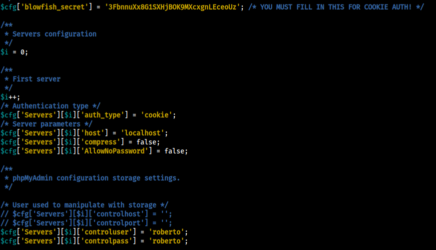
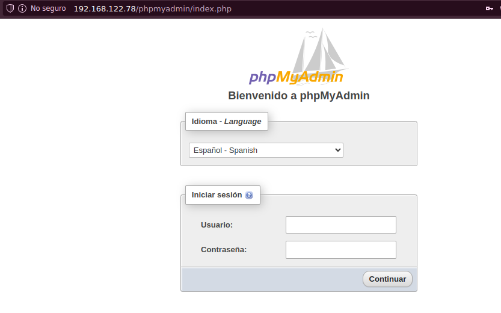
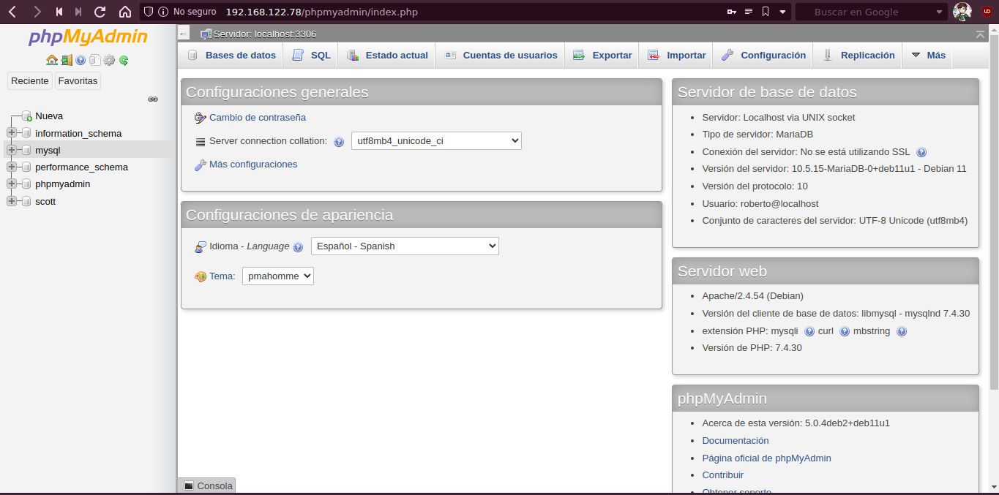
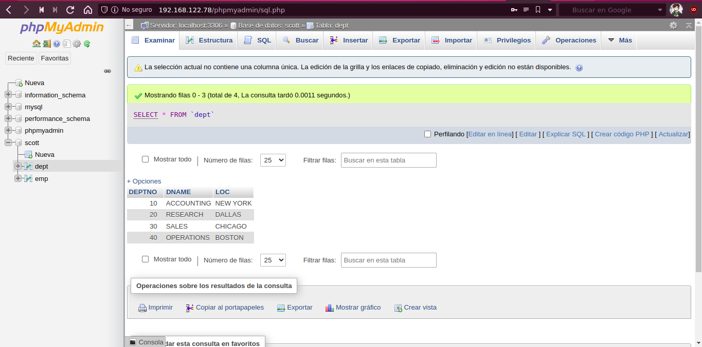

## Instalación

instalamos php:

```bash
apt install apache2 libapache2-mod-php php php-mysql
apt install php-zip php-gd php-mbstring phpmyadmin -y
```

## Configuración

En la instalación de phpmyadmin elegimos como servidor **apache2**, después, cuando nos pregunta por una contraseña, le damos a Sí, e introducimos una contraseña para phpmyadmin dos veces

Una vez instalado, para poder acceder con un usuario concreto, tenemos que hacer lo siguiente:

Entramos en el directorio de phpmyadmin y copiamos un fichero de ejemplo para utilizarlo como configuración:

```bash
cd /usr/share/phpmyadmin/
cp config.sample.inc.php config.inc.php
```

en el fichero `config.inc.php` tenemos que añadir a `blowfish_secret` una cadena de 30 caracteres, y tenemos que descomentar las lineas de `controluser`y `controlpass` y añadirles las credenciales.



Una vez realizada la configuración, reiniciamos el servicio:

```bash
systemctl reload apache2
```

## Prueba

y podemos acceder a la página de administración en `http://IPmaquina/phpmyadmin/`:



