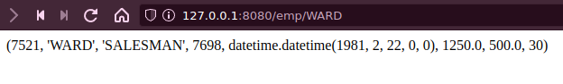
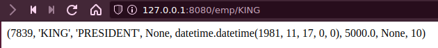

Aplicación web Oracle programada en python.

## Preparación

Antes de crear el fichero que va a ser la aplicación, vamos a crear un **Entorno virtual** (Venv) de python para contener ahí los módulos que nos descarguemos

```bash
mkdir aplicacion_web_oracle && cd aplicacion_web_oracle
python3 -m venv /home/roberto/aplicacion_web_oracle
source bin/activate
```

Ahora vamos a descargar los módulos necesarios:

```bash
pip install cx_oracle
pip install flask
```

Ahora, usando **flask**, se ha escrito la siguiente aplicación sencilla, que permite, al introducirle el nombre de un empleado en la dirección `/emp/`, mostrar los datos de dicho empleado. Es importante que, cuando se define **pool** se introduzcan los mismo datos que en el acceso remoto a oracle, ya que esta aplicación se ha creado desde una máquina distina a la de oracle.

```python
import os
import sys
import cx_Oracle
from flask import Flask

def init_session(connection, requestedTag_ignored):
    cursor = connection.cursor()
    cursor.execute("""
        ALTER SESSION SET
          TIME_ZONE = 'UTC'
          NLS_DATE_FORMAT = 'YYYY-MM-DD HH24:MI'""")

# start_pool(): starts the connection pool
def start_pool():
    pool_min = 4
    pool_max = 4
    pool_inc = 0
    pool_gmd = cx_Oracle.SPOOL_ATTRVAL_WAIT

    print("Connecting to", "192.168.122.105:1521/ORCLCDB")

    pool = cx_Oracle.SessionPool(user="roberto",
                                 password="roberto",
                                 dsn="192.168.122.105:1521/ORCLCDB",
                                 min=pool_min,
                                 max=pool_max,
                                 increment=pool_inc,
                                 threaded=True,
                                 getmode=pool_gmd,
                                 sessionCallback=init_session)

    return pool

app = Flask(__name__)

@app.route('/')
def index():
    return "Entra en /emp/nombreempleado para ver los datos del empleado"


# Show the username for a given id
@app.route('/emp/<string:name>')
def show_username(name):
    connection = pool.acquire()
    cursor = connection.cursor()
    cursor.execute("select * from emp where ename = (:name)", [name])
    r = cursor.fetchone()
    r = str(r)
    return (r)

################################################################################
#
# Initialization is done once at startup time
#
if __name__ == '__main__':

    # Start a pool of connections
    pool = start_pool()


    # Start a webserver
    app.run(port=int(os.environ.get('PORT', '8080')))
```




